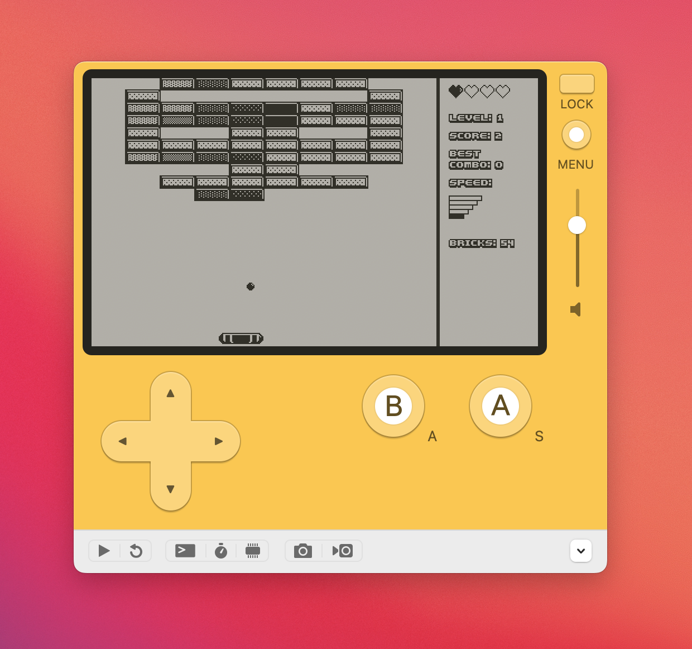

# BrickCrusher2020 for Playdate



## Download

Wnat to play? You can download BrickCrusher2020 by clicking here:

[](https://aliasaria.itch.io/brickcrusher-2020-for-playdate)

## Development

Download the Playdate SDK https://play.date/dev/ (tested on v1.12.3 on macOS) and install.

Once you have `make` installed, you can run:

```
make build
```

to build and run the app

You can also run:

```
make build-production
```

to build a clean production binary for distribution.
